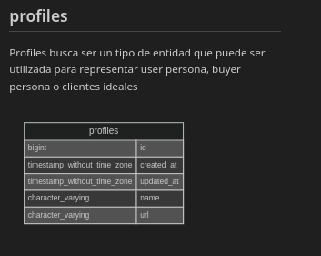

<!-- START doctoc generated TOC please keep comment here to allow auto update -->
<!-- DON'T EDIT THIS SECTION, INSTEAD RE-RUN doctoc TO UPDATE -->
**Table of Contents** *generated with [DocToc](https://github.com/thlorenz/doctoc)*

- [Database Knowledgeable](#databaseknowledgeable)
- [Database Knowledgeable: Get information from](#databaseknowledgeable-get-information-from)
- [License](#license)
- [Characteristics What does data-auditor offer you?](#characteristics-%C2%BFqu%C3%A9-te-offers-data-auditor)
- [Features to implement / Caracteristicas a implement](#features-to-implement--caracteristicas-a-implementar)
- [Planning, Requirements Engineering and risk management / Planning, Requirements Engineering and risk management](#planning-requirements-engineering-and-risk-management--planacion-ingenieria-de-requerimientos-y-gestion-del-risk )
- [Software Design / Software Design](#software-design--dise%C3%B1o-de-software)
- [Structural Perspective](#structural-perspective)
- [Logical View of Software Architecture](#logical-view-of-software-architecture)
- [Behavioral Perspective](#behavioral-perspective)
- [Documentation](#documentation)
- [Conventions used during documentation](#conventions-used-during-documentation)
- [Support and Limitations of algorithms](#support-and-limitations-of-algorithms)
- [Algorithms used to determine PK, Fk and other attributes](#algorithms-used-to-determine-pk-fk-and-other-attributes)
- [Naming conventions used for element identification](#naming-conventions-used-for-element-identification)
- [Primary Keys](#primary-keys)
- [Examples](#examples)
- [Foreign Keys](#foreign-keys)
- [Examples](#examples-1)
- [Examples of use](#examples-of-use)
- [Make a donation. Your contribution will make a difference.](#make-a-donation-your-contribution-will-make-a-difference)
- [Find me on:](#find-me-on)
- [Technologies used / Tecnologias usadas](#technologies-used--tecnologias-usadas)

<!-- END doctoc generated TOC please keep comment here to allow auto update -->


# Database Knowledgeable

[Readme version in English](./README-EN.md)

## Database Knowledgeable: Get information about

database-knowledgeable allows you to obtain basic information from your database, generate reports and documentation in popular formats such as markdown and mermaid. More specifically



## License

This code is licensed under the GNU General Public License version 3.0 or later (LGPLV3+). A full copy of the license can be found at https://www.gnu.org/licenses/lgpl-3.0-standalone.htmlalone.html0-standalone.html

## Features What does data-auditor offer you?

database-knowledgeable allows you to obtain basic information from your database, generate reports and documentation in popular formats such as markdown and mermaid. More specifically

- Generate a markdown report where each table in your database is listed, along with a mermaid diagram, a brief explanation of the table, its fields, etc.

- Only postgresql is supported

## Features to implement

- Generation of entity relationship diagrams

- Generation of the relational model

- Support for more Database Management Systems
## Planning, Requirements Engineering and risk management / Planning, Requirements Engineering and risk management

These sections of the project will be carried out through a conceptual site so that they can be easily accessible by non-technical personnel.

Request the access link from authorized personnel

## Software Design / Software Design

### Structural Perspective

#### Logical View of the Software Architecture

### Behavioral perspective

## Documentation

### Conventions used during documentation

Notation Conventions for Grammar:

The <> are used to surround a non-terminal symbol

The ::= is used for production rules

Non-terminal symbols are expressed as a string or normal characters

The following group of pairs of symbols should be used together with expressions in the following way: the first in each pair is written as a suffix after the expression and the second surrounds the expression.

He ? or [] indicate that the expression is optional

The * or {} indicates that the expression is repeated 0 or more times

The + indicates that the expression is repeated 1 or more times

If you want to use one of the previous characters, you must precede \ with

### Support and Limitations of algorithms

Unfortunately, some DBMS support SQL standards differently, so there is no universal algorithm that works perfectly for all DBMSs.

We hope in the future to be able to change this but currently I only use it as a personal tool and I lack the time resources to add these features. Only proven support will be provided to postgresql.

#### Algorithms used to determine PK, Fk and other attributes

Although the information_schema view set could be used to determine some of the database structures

It was discovered that additive joins are usually generated in Postgresql, so naming conventions were used for speed. We hope to improve this feature in the future.

Additive join failure example

For example, if you wanted to know if a column in the information_schema.key_column_usage is a PRIMARY KEY, FOREIGN KEY, etc., you would use the query

```sql
SELECT kcu.column_name,kcu.table_name,tc.constraint_name,tc.constraint_type
FROM
information_schema.table_constraints tc
JOIN
information_schema.key_column_usage kcu
ON tc.constraint_name = kcu.constraint_name
```
However, if we look closely, these results are affected by an additive join.

For the particular case of having
```sql
SELECT column_name,table_name FROM information_schema.key_column_usage WHERE table_name ~ '^insight_taxonomy$'
```

which gives results like this


and a
```sql
SELECT tc.constraint_name
FROM
information_schema.table_constraints tc
WHERE
tc.constraint_name ~ '^taxonomy_id_fkey$'
```
which gives results like this


you have to

```sql
SELECT kcu.column_name,kcu.table_name,tc.constraint_name,tc.constraint_type
FROM
information_schema.table_constraints tc
JOIN
information_schema.key_column_usage kcu
ON tc.constraint_name = kcu.constraint_name
WHERE
kcu.table_name ~ '^insight_taxonomy$'

```

generates the following results that reflect the additive join


##### Naming conventions used for element identification

###### Primary Keys
All id name attribute

###### Examples
id

###### Foreign Keys
Any attribute that has the following form
```
<nextTableName>[_<role>]_id

Where [role] serves to identify the entity in recursive relationships

```

Match the following regular expression
```
^[a-zA-Z0-9ñ]+(?:_[a-zA-Z0-9ñ]+)?_id$
```
###### Examples
- user_id
-taxonomy_child_id
-taxonomy_parent_id


### Examples of use

Set a configuration in the .env file. like the following

```

DB_CONNECTION=pgsql
DB_HOST=127.0.0.1
DB_PORT=5432
DB_DATABASE=<DatabaseName>
DB_USERNAME=<UserName>
DB_PASSWORD=<password>

```

then in a php file anyone calls the library as follows

```

<?php

include __DIR__."/vendor/autoload.php";

use Israeldavidvm\DatabaseKnowledgeable\DatabaseKnowledgeable;

$metaInfoEnvFile=[
'pathEnvFolder'=>'.',
'name'=>'.env',
'mode'=>'exclude',
'tables'=>[],
];

$databaseKnowledgeable = new DatabaseKnowledgeable($metaInfoEnvFile);

$databaseKnowledgeable->generateDocumentation();

```

output table example


### Make a donation. Your contribution will make a difference.
[](https://ko-fi.com/israeldavidvm)
[](https://paypal.me/israeldavidvm )
[](https://www.binance.com/ activity/referral-entry/CPA?ref=CPA_004ZGH9EIS)

### Find me on:
[](https://github.com/israeldavidvm)
[](https://www.linkedin.com/ in/israeldavidvm/)
[](https://twitter.com/israeldavidvm )
[](https://www.facebook.com/ israeldavidvm)
[](https://www.instagram.com /israeldavidvm/)
[](https://www.tiktok.com /@israeldavidvm)
[](https://www.youtube.com /channel/UCmZLFpEPNdwpJOhal0wry7A)

## Technologies used / Used technologies

[]()
