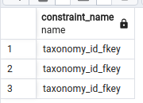

<!-- START doctoc generated TOC please keep comment here to allow auto update -->
<!-- DON'T EDIT THIS SECTION, INSTEAD RE-RUN doctoc TO UPDATE -->
**Table of Contents**  *generated with [DocToc](https://github.com/thlorenz/doctoc)*

- [DatabaseKnowledgeable](#databaseknowledgeable)
  - [Licencia](#licencia)
  - [Caracteristicas ¿Qué te ofrece?](#caracteristicas-%C2%BFqu%C3%A9-te-ofrece)
  - [Features to implement / Caracteristicas a implementar](#features-to-implement--caracteristicas-a-implementar)
  - [Planning, Requirements Engineering and risk management / Planeacion, Ingenieria de Requerimientos y gestion del riesgo](#planning-requirements-engineering-and-risk-management--planeacion-ingenieria-de-requerimientos-y-gestion-del-riesgo)
  - [Software Design / Diseño de Software](#software-design--dise%C3%B1o-de-software)
    - [Perspectiva Estructural](#perspectiva-estructural)
      - [Vista Logica de la Arquitectura del software](#vista-logica-de-la-arquitectura-del-software)
    - [Perspectiva de comportamiento](#perspectiva-de-comportamiento)
  - [Documentacion](#documentacion)
    - [Convenciones usadas durante la docuemntacion](#convenciones-usadas-durante-la-docuemntacion)
    - [Soporte y Limitantes de los algoritmos](#soporte-y-limitantes-de-los-algoritmos)
      - [Algoritmos usados para determinar PK, Fk y demas atributos](#algoritmos-usados-para-determinar-pk-fk-y-demas-atributos)
        - [Convenciones de nombres usada para la identificacion de elementos](#convenciones-de-nombres-usada-para-la-identificacion-de-elementos)
          - [Llaves Primarias](#llaves-primarias)
          - [Ejemplos](#ejemplos)
          - [Llaves Foraneas](#llaves-foraneas)
          - [Ejemplos](#ejemplos-1)
    - [Uso](#uso)
      - [Requisitos](#requisitos)
        - [Instalacion](#instalacion)
          - [Como usuario](#como-usuario)
          - [Como biblioteca (Solo si quieres crear un programa que use la libreria)](#como-biblioteca-solo-si-quieres-crear-un-programa-que-use-la-libreria)
        - [Archivo .env](#archivo-env)
      - [Uso desde la interfaz de linea de comandos](#uso-desde-la-interfaz-de-linea-de-comandos)
      - [Uso como libreria](#uso-como-libreria)
    - [Make a donation. Your contribution will make a difference.](#make-a-donation-your-contribution-will-make-a-difference)
    - [Find me on:](#find-me-on)
  - [Technologies used / Tecnologias usadas](#technologies-used--tecnologias-usadas)

<!-- END doctoc generated TOC please keep comment here to allow auto update -->


# DatabaseKnowledgeable

[Readme version in English](./README-EN.md)

database-knowledgeable te permite obtener infomcacion basica de tu base de datos, generar informes y documentacion en formatos populares como markdown y mermaid. Mas concretamente


## Licencia

Este código tiene licencia bajo la licencia pública general de GNU versión 3.0 o posterior (LGPLV3+). Puede encontrar una copia completa de la licencia en https://www.gnu.org/licenses/lgpl-3.0-standalone.htmlalone.html0-standalone.html

## Caracteristicas ¿Qué te ofrece?

database-knowledgeable te permite obtener infomcacion basica de tu base de datos, generar informes y documentacion en formatos populares como markdown y mermaid. Mas concretamente

- Genera un informe markdown donde se enuncia cada tabla de tu base de datos, junto a un diagrama de mermaid, una breve explicacion de la tabla, sus campos, etc.

- Solo se tiene soporte para postgresql

## Features to implement / Caracteristicas a implementar

- Generacion de diagramas entidad relacion 

- Generacion del modelo relacional

- Soporte a mas Sistemas Gestores de Base de Datos
## Planning, Requirements Engineering and risk management / Planeacion, Ingenieria de Requerimientos y gestion del riesgo

Estas secciones del proyecto se llevara por medio de un sitio en notion de forma que puedan ser facilmente accesibles por el personal no tecnico.

Solicita el link de acceso al personal autorizado

## Software Design / Diseño de Software

### Perspectiva Estructural

#### Vista Logica de la Arquitectura del software 

### Perspectiva de comportamiento

## Documentacion

### Convenciones usadas durante la docuemntacion

Convenciones de notacion para la gramatica:

Los <> se utilizan para rodear un simbolo no terminal

El ::= se utiliza para reglas de produccion

Los simbolos no terminales se expresan como una cadena o caracteres normales

El siguiente grupo de pares de simbolos, se deben utilizar junto a las expresiones de la siguiente forma: el primero en cada pareja se escribe como sufijo despues de la expresion y el segundo rodea la expresion. 

El ? o [] indican que la expresion es opcional

El * o {} indica que la expresion se repite 0 o mas veces

El + indica que la expresion se repite 1 o mas veces

Si se quiere usar uno de los caracteres anteriores se debe de anteceder \ con 

### Soporte y Limitantes de los algoritmos

Lamentablemente algunos SGBD, dan soporte a los estadares de sql de forma diferente por lo que no existe una algoritmo universal que funcione perfectamente para todos los SGBD.

Esperamos en el futuro poder cambiar esto pero actualmente solo lo uso como herramienta personal y carezco de los recursos de tiempo para añadir dichas caracteristicas solo se proporcionara soporte comprobado a postgresql

#### Algoritmos usados para determinar PK, Fk y demas atributos

Si bien se pudo usar el conjunto de vistas de information_schema para determinar algunas de las estructuras de la base de datos

Se descubrio que en postgresql se suelen generar joins aditivos, de manera que se utilizaran convenciones de nombres por rapidez. Esperamos mejorar dicha caracteristica en el futuro.

Ejemplo de falla del join aditivo

Por ejemplo si se quisiera saber si una columna en la information_schema.key_column_usage es una PRIMARY KEY, FOREIGN KEY, etc, deberia usarse la consulta

```sql
SELECT kcu.column_name,kcu.table_name,tc.constraint_name,tc.constraint_type 
            FROM 
                information_schema.table_constraints tc
            JOIN
                information_schema.key_column_usage kcu
                    ON tc.constraint_name = kcu.constraint_name
```    
Sin embargo si observamos detenidamente dichos resultados se ven afectados por un join aditivo

Para el caso particular de tener
```sql
SELECT column_name,table_name FROM information_schema.key_column_usage WHERE table_name ~ '^insight_taxonomy$'
```

que arroja resultados de esta forma


y un 
```sql
SELECT tc.constraint_name
            FROM 
                information_schema.table_constraints tc               
            WHERE 
				tc.constraint_name ~ '^taxonomy_id_fkey$'
```
que arroja resultados de esta forma



se tiene que el

```sql
SELECT kcu.column_name,kcu.table_name,tc.constraint_name,tc.constraint_type 
            FROM 
                information_schema.table_constraints tc
            JOIN
                information_schema.key_column_usage kcu
                    ON tc.constraint_name = kcu.constraint_name
            WHERE 
				kcu.table_name ~ '^insight_taxonomy$'

```

genera los siguientes resultados que reflejan el join aditivo


##### Convenciones de nombres usada para la identificacion de elementos

###### Llaves Primarias
Todo atributo de nombre id 

###### Ejemplos
id

###### Llaves Foraneas
Todo atributo que posee la siguiente forma 
```
<nombreTablaSigular>[_<rol>]_id 

Donde [rol] sirve para identificar a la entidad en las relaciones recursivas

```

Coincide con la siguiente expresion regular
```
^[a-zA-Z0-9ñ]+(?:_[a-zA-Z0-9ñ]+)?_id$
```
###### Ejemplos
- user_id
- taxonomy_child_id
- taxonomy_parent_id

### Uso

#### Requisitos 

##### Instalacion 

###### Como usuario

composer require israeldavidvm/database-knowledgeable

###### Como biblioteca (Solo si quieres crear un programa que use la libreria)
composer require israeldavidvm/database-knowledgeable

##### Archivo .env

Establece una configuracion en el archivo .env. como la siguiente

```

DB_CONNECTION=pgsql
DB_HOST=127.0.0.1
DB_PORT=5432
DB_DATABASE=<DatabaseName>
DB_USERNAME=<UserName>
DB_PASSWORD=<password>

```

#### Uso desde la interfaz de linea de comandos 

Para poder usar el programa solo necesitaras un archivo .env con la configuracion de tu base de datos como se especifico anteriormente y ejecutar el comando


```composer generateMarkdownDocumentation [<depth> [<path>]] ```

Arguments:
  depth                 Profundidad de los encabezados [default: 1]
  path                  La ruta al archivo .env. [default: "./.env"]

Options:
  -h, --help            Display help for the given command. When no command is given display help for the list command
      --silent          Do not output any message
  -q, --quiet           Only errors are displayed. All other output is suppressed
  -V, --version         Display this application version
      --ansi|--no-ansi  Force (or disable --no-ansi) ANSI output
  -n, --no-interaction  Do not ask any interactive question
  -v|vv|vvv, --verbose  Increase the verbosity of messages: 1 for normal output, 2 for more verbose output and 3 for debug


#### Uso como libreria

En un archivo php cualquiera llama a la biblioteca de la siguiente forma

```

<?php

include __DIR__."/vendor/autoload.php";

use Israeldavidvm\DatabaseKnowledgeable\DatabaseKnowledgeable;

$metaInfoEnvFile=[
    'pathEnvFolder'=>'.',
    'name'=>'.env',
    'mode'=>'exclude',
    'tables'=>[],
];

$databaseKnowledgeable = new DatabaseKnowledgeable($metaInfoEnvFile);

$databaseKnowledgeable->generateMarkdownDocumentation($depth);

```

ejemplo de tabla de salida 


### Make a donation. Your contribution will make a difference.
[](https://ko-fi.com/israeldavidvm)
[](https://paypal.me/israeldavidvm)
[](https://www.binance.com/activity/referral-entry/CPA?ref=CPA_004ZGH9EIS)

### Find me on:
[](https://github.com/israeldavidvm)
[](https://www.linkedin.com/in/israeldavidvm/)
[](https://twitter.com/israeldavidvm)
[](https://www.facebook.com/israeldavidvm)
[](https://www.instagram.com/israeldavidvm/)
[](https://www.tiktok.com/@israeldavidvm)
[](https://www.youtube.com/channel/UCmZLFpEPNdwpJOhal0wry7A)

## Technologies used / Tecnologias usadas

[]() 
