<!-- START doctoc generated TOC please keep comment here to allow auto update -->
<!-- DON'T EDIT THIS SECTION, INSTEAD RE-RUN doctoc TO UPDATE -->
**Table of Contents**  *generated with [DocToc](https://github.com/thlorenz/doctoc)*

- [Explicacion de las tablas en la Base de Datos](#explicacion-de-las-tablas-en-la-base-de-datos)
  - [migrations](#migrations)
  - [password_resets](#password_resets)
  - [failed_jobs](#failed_jobs)
  - [personal_access_tokens](#personal_access_tokens)
  - [concepts](#concepts)
  - [images](#images)
- [Images](#images)
  - [Convenciones de notacion para la gramatica:](#convenciones-de-notacion-para-la-gramatica)
  - [Gramatica de las urls](#gramatica-de-las-urls)
  - [Generacion de rutas para Imagenes Responsivas, no responsivas locales y externas](#generacion-de-rutas-para-imagenes-responsivas-no-responsivas-locales-y-externas)
    - [Ruta a Imagen no responsiva local o externa](#ruta-a-imagen-no-responsiva-local-o-externa)
    - [Rutas a imagenes locales o externas responsivas](#rutas-a-imagenes-locales-o-externas-responsivas)
    - [ConventionalDir](#conventionaldir)
    - [Externa o interna](#externa-o-interna)
  - [Almacenar las rutas a un imagen en la base de datos:](#almacenar-las-rutas-a-un-imagen-en-la-base-de-datos)
  - [Rutas para ser almacenadas en BD de recursos como imagenes o directorios locales siguiendo las convenciones de laravel:](#rutas-para-ser-almacenadas-en-bd-de-recursos-como-imagenes-o-directorios-locales-siguiendo-las-convenciones-de-laravel)
  - [Rutas para trabajar con el Storage de recursos como imagenes o directorios locales siguiendo las convenciones de laravel:](#rutas-para-trabajar-con-el-storage-de-recursos-como-imagenes-o-directorios-locales-siguiendo-las-convenciones-de-laravel)
  - [Almacenar la ruta base de una imagen en la base de datos](#almacenar-la-ruta-base-de-una-imagen-en-la-base-de-datos)
    - [Usando la convencion de Laravel y la convencion de directoros con el mismo nombre de la imagen para imagenes locales](#usando-la-convencion-de-laravel-y-la-convencion-de-directoros-con-el-mismo-nombre-de-la-imagen-para-imagenes-locales)
    - [Usando solo la convencion de directoros con el mismo nombre de la imagen](#usando-solo-la-convencion-de-directoros-con-el-mismo-nombre-de-la-imagen)
  - [Recuperar imagenes en la bd:](#recuperar-imagenes-en-la-bd)
  - [insight_taxonomy](#insight_taxonomy)
  - [insight_valueproposition](#insight_valueproposition)
  - [profile_taxonomy](#profile_taxonomy)
  - [profiles](#profiles)
  - [source_taxonomy](#source_taxonomy)
  - [publication_taxonomy](#publication_taxonomy)
  - [publications](#publications)
  - [sources](#sources)
  - [source_user](#source_user)
  - [taxonomy_valueproposition](#taxonomy_valueproposition)
  - [insights](#insights)
  - [insight_profile_source](#insight_profile_source)
  - [taxonomies](#taxonomies)
  - [Explanation of some taxonomies / Explicación de algunas taxonomías](#explanation-of-some-taxonomies--explicaci%C3%B3n-de-algunas-taxonom%C3%ADas)
  - [valuepropositions](#valuepropositions)
  - [profile_profile_source_valueproposition](#profile_profile_source_valueproposition)
  - [users](#users)
  - [taxonomy_taxonomy](#taxonomy_taxonomy)
  - [valueproposition_valueproposition](#valueproposition_valueproposition)

<!-- END doctoc generated TOC please keep comment here to allow auto update -->

#### Explicacion de las tablas en la Base de Datos
##### migrations

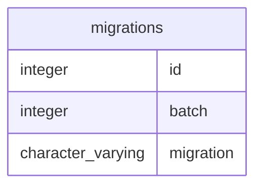
##### password_resets

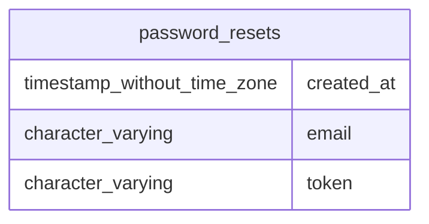
##### failed_jobs

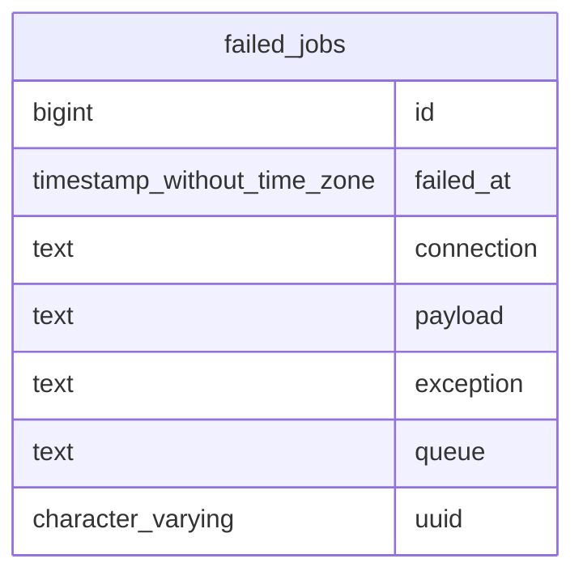
##### personal_access_tokens

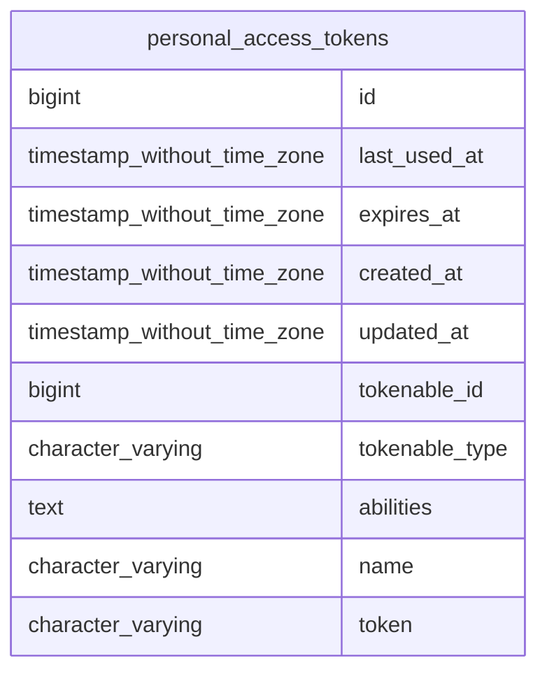
##### concepts


##### images
#### Images
Con el objetivo de aumentar la flexibilidad del sistema se dara soporte a imagenes normales he imagenes responsive, tambien se permitira que las mismas tengan un almacenamiento local o externo.

Una imagen tendra un campo boleano para indicar si es responsive o no.

Para que en funcion de eso se genere un conjunto de url para cada variacion de imagen en caso de que la imagen sea responsive o una url a una imagen en caso de no serlo


##### Convenciones de notacion para la gramatica:

Los <> se utilizan para rodear un simbolo no terminal

El ::= se utiliza para reglas de produccion

Los simbolos no terminales se expresan como una cadena o caracteres normales

El siguiente grupo de pares de simbolos, se deben utilizar junto a las expresiones de la siguiente forma: el primero en cada pareja se escribe como sufijo despues de la expresion y el segundo rodea la expresion. 

El ? o [] indican que la expresion es opcional

El * o {} indica que la expresion se repite 0 o mas veces

El + indica que la expresion se repite 1 o mas veces

Si se quiere usar uno de los caracteres anteriores se debe de anteceder \ con 

##### Gramatica de las urls

De manera que la libreria utilizara la siguiente gramatica para sus urls

```<baseUrl>/<dirImage>(/<imageName>)? | <baseUrl>/<imageName>```

Donde: 
Los metodos que contienen InLaravelConvetionalLink suelen darle el valor a
```
<baseUrl>  "/storage/images" 
```
Y los metodos que contienen InLaravelConvetionalStorage suelen darle el valor a
```
<baseUrl>  "/images" 
```

Donde:
Los metodos que contienen InConvetionalDir suelen darle el valor a
```
<dirImage> de el resultado de NameHelper::transformNameToRouteName($imageName)
```

Notese que la diferencia entre una url externa he interna se basa en el valor de ```<baseUrl>```

##### Generacion de rutas para Imagenes Responsivas, no responsivas locales y externas

La diferencia entre una imagen responsiva y otro que no lo es radica en que para la imagen responsiva se utilizaran conjuntos de url una por cada variacion de la imagen y en la otra no. De manera que tendran una forma como la siguiente


###### Ruta a Imagen no responsiva local o externa 
```
<NonResponsiveImageUrl>::= <baseUrl>(/<dirImage>)?/<imageName>
```

Como por ejemplo 

```/storage/images/imagen/imagen.jpg```


###### Rutas a imagenes locales o externas responsivas

Para este caso se generara un conjunto de rutas con la sitaxis de las imagenes no responsivas

```
<ResponsiveVariationImageUrl>::= <baseUrl>(/<dirImage>)?/<imageName>
```

Como por ejemplo 

```/storage/images/imagen/360-image.jpg```

###### ConventionalDir
Donde:
Los metodos que contienen InConvetionalDir suelen darle el valor a
```
<dirImage> de el resultado de NameHelper::transformNameToRouteName($imageName)
```

###### Externa o interna

Notese que la diferencia entre una url externa he interna se basa en el valor de ```<baseUrl>```

##### Almacenar las rutas a un imagen en la base de datos:

Con el objetivo de permitir que el almacenamiento de las imagenes sea lo mas flexible posible, se hara lo siguiente.

Se guardara la ruta al directorio de la carpeta que la contiene (solo la carpeta sin el nombre de la imagen) y el nombre de la imagen en la base de datos.

De forma que se pueda tomar esa ruta base, el nombre de la imagen y generar una ruta o conjunto de rutas dependiendo de si la imagen es responsive o no.

##### Rutas para ser almacenadas en BD de recursos como imagenes o directorios locales siguiendo las convenciones de laravel:

A la hora de almacenar la url de nuestros recursos (como imagenes imagenes, directorios, etc), deberiamos considerar almacenar la url que nos permite acceder al recurso de forma publica, en la configuracion por defecto de laravel hay una ruta contemplada para ello.

De modo que desarrollamos una serie de metodos que terminan en InLaravelConvetionalLink que generara una url hacia dichas rutas.

##### Rutas para trabajar con el Storage de recursos como imagenes o directorios locales siguiendo las convenciones de laravel:

Al igual que existe una convencion para las rutas hacia los recursos que son accesibles de forma publica existe una convencion para las rutas reales hacia los recursos en la configuracion por defecto de laravel.

##### Almacenar la ruta base de una imagen en la base de datos

Como dijimos anteriormente uno de los enfoques que se pueden tomar para maximizar la flexibilidad a la hora de trabajar con imagenes 

Es el de solo almacenar la ruta en la que se almacena la imagen

###### Usando la convencion de Laravel y la convencion de directoros con el mismo nombre de la imagen para imagenes locales

Que para el caso en que queramos usar la convencion de laravel debera ser la que es accesible de forma publica ruta que puede ser obtenida por medio del metodo

```
NameHelper::generateRouteToConvetionalDirInLaravelConvetionalLink($imageName)
```

Lo que generara una url de imagen como 
```/storage/images/imagen-perro/```

Notese que dicho metodo anexa una carpeta al final de la ruta que usa laravel por convencion

###### Usando solo la convencion de directoros con el mismo nombre de la imagen

Que puede ser obtenida por el metodo, notese que dependiendo de si la base url es externa o no se hablara de imagen externa o interna

```
NameHelper::generateRouteToConvetionalImageDirInBaseRoute($imageName,$baseUrl=null)

```

```
<ResponsiveUrl>::= <baseUrl>/<dirImage>
```
Como por ejemplo 
```/storage/images/imagen/```


##### Recuperar imagenes en la bd:

En caso de haber almacenado la ruta completa hacia la carpeta que contiene el recurso en la base de datos como recomendamos

Los nombres de las imagenes podran ser recuperados de la siguiete forma

```
NameHelper::generateRoutesToResponsiveImagesInBaseRoute($imageName, $baseUrl);
```
cuando la imagen es responsiva o 

```
NameHelper::generateRouteToImageInBaseRoute($imageName,$baseUrl=null)
```

cuando la imagen no es responsiva.

En caso de no haber almacenado la ruta completa hacia la carpeta que contiene el recurso en la base de datos como recomendamos

```
NameHelper::generateRoutesToResponsiveImagesInConvetionalDirInBaseRoute($imageName,$baseUrl)
```

O 
```
NameHelper::generateRoutesToResponsiveImagesInConvetionalDirInLaravelConvetionalLink($imageName)
```
que añadiran la informacion necesaria
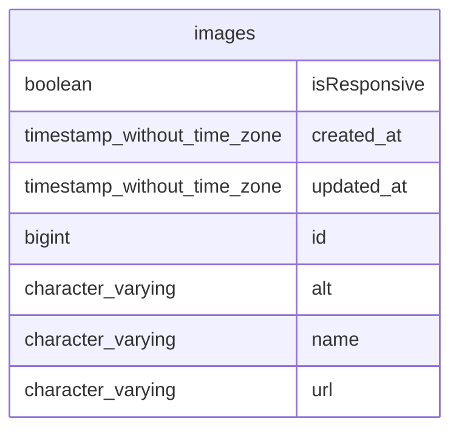
##### insight_taxonomy

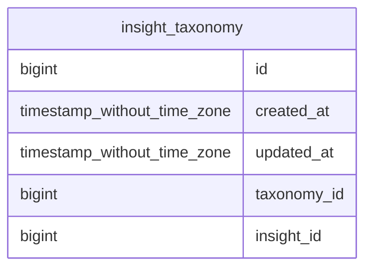
##### insight_valueproposition

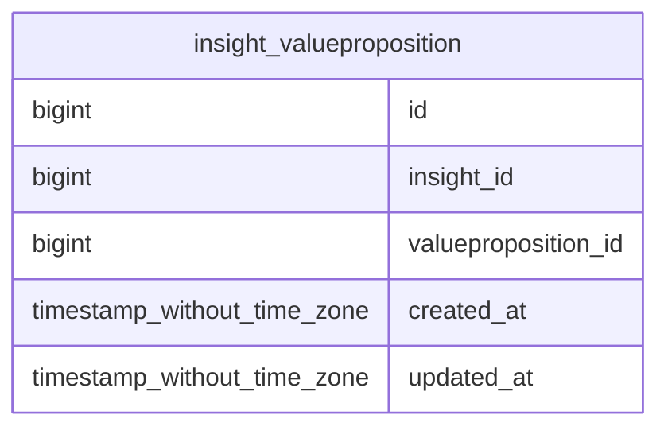
##### profile_taxonomy

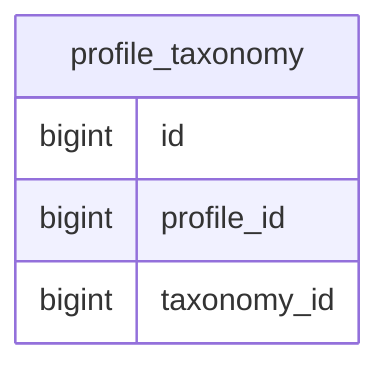
##### profiles
Profiles busca ser un tipo de entidad que puede ser utilizada para representar user persona, buyer persona o clientes ideales
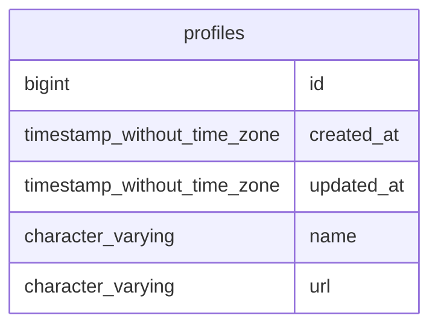
##### source_taxonomy

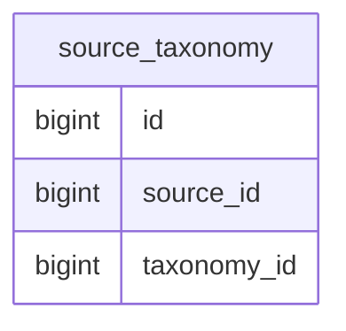
##### publication_taxonomy

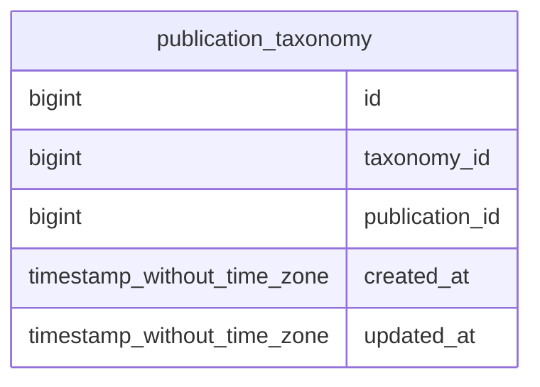
##### publications
La idea detras de una publicacion es poder representar varios tipos de contenido en una pagina web, como por ejemplo html, markdown, una estructura json que sera convertida a html, etc.

De alli que se utilize el campo taxonomy_contentType_id para identificar el tipo de contenido almacenado en el campo content

Por otro lado dado que una pagina debe de tener una descripcion para el seo, se utilizara una descripcion que se almacenara en el campo description
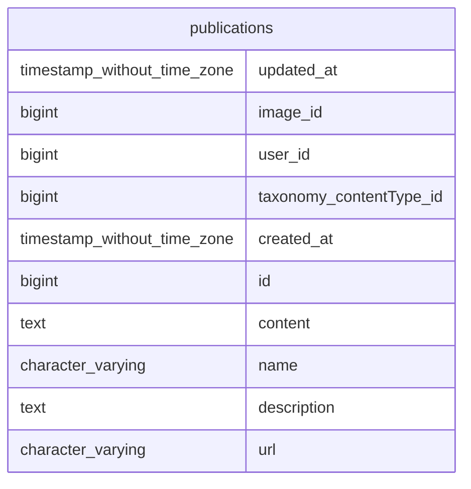
##### sources

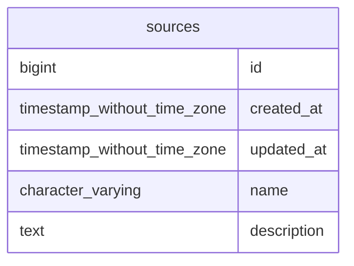
##### source_user

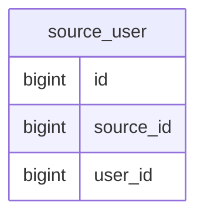
##### taxonomy_valueproposition

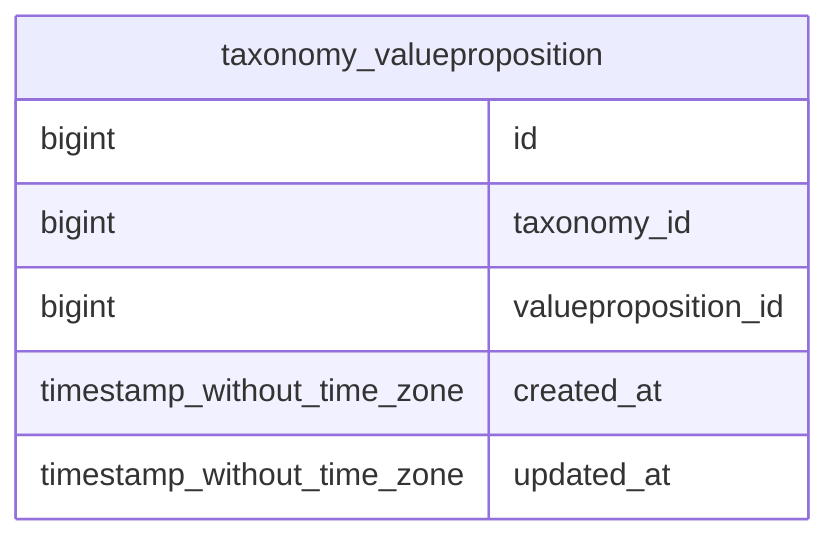
##### insights

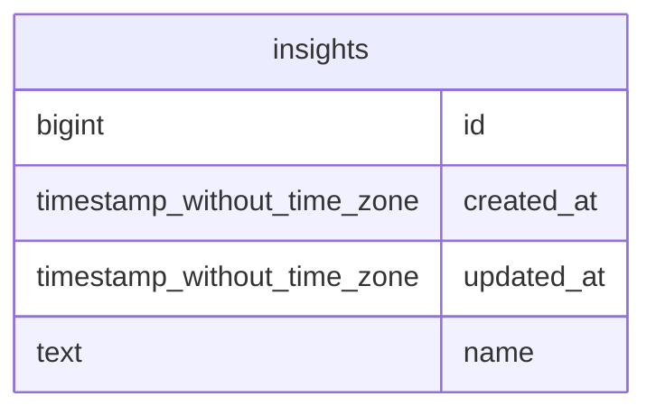
##### insight_profile_source
Esta tabla permite asociar los insight a un profile, y ademas asociar una puntuacion y source a esa accion de asociar el insight a un perfil

Lo que establece un mecanismo para:

- evaluar la veracidad del insight, es decir asegurarse que el insight viene de la realidad
- valorar y priorizar los insight
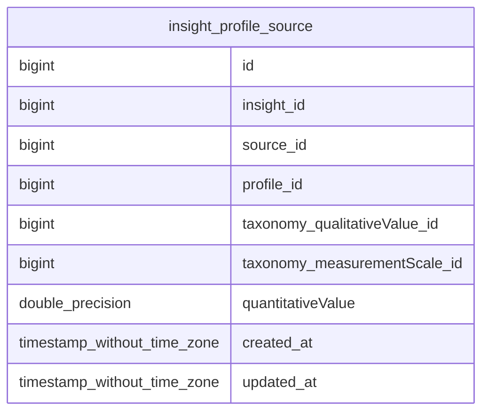
##### taxonomies
Con el objetivo de aumentar la flexibilidad del sistema se utilizo un diseño de taxonomias recursivas lo que permite crear taxonomias de taxonomias y agregar nuevas taxonomias.

Notese que una taxonomia puede tener muchas taxonomias padres al igual que puede tener muchas taxonomias hijas

Cabe destacar que tambien se considero un mecanismo de clasificacion de la taxonomia en base a los tipos de entidad asociados. es decir se sabria que una taxonomia de post como tecnologia, es una taxonomia utilizada para los post puesto que la misma esta asociada a una entidad de tipo post.

Lo que permitiria facilitar la creacion y asociacion de taxonomias a entidades por parte del admin del site,  Sin embargo aparecieron limmitantes cuando se queria que para un tipo de entidad se usaran varios tipos de taxonomias. por lo que se termino desxcartando dicha implementacion


##### Explanation of some taxonomies / Explicación de algunas taxonomías

- **Value Proposition**: Engloba las propuestas de valor, tanto para el consumidor como para la carrera profesional.
  
- **entrepreneurship valueproposition**: Define los productos, servicios y diferenciadores que se ofrece al consumidor final. Ejemplos: **offer**, **differentiator**, **product**.
  
- **Career Value Proposition**: Describe los las propuestas de valor que se ofrecen en determinada carrera profesional, se divide en 2 tipos **career valueproposition areas** y **career valueproposition types**. 

- **career valueproposition types**:**competencias, conocimientos y habilidades duras**, **tecnologías**, **competencias, conocimientos y habilidades blandas**, **experiencias**, **estudios**, **extras**.

- **career valueproposition areas**:**ingeniería del software**, **bases de datos**, **sistemas distribuidos**, **aplicaciones web**, **optimización de algoritmos y estructuras de datos**, **manejo de lenguajes de bajo y alto nivel**, **auditoría**, **seguridad informática**, **infraestructura, sistemas operativos, redes y cloud**, **matemáticas abstractas (lógica, matemáticas discretas, álgebra de estructuras, lenguajes formales y autómatas, etc.)**, **analítica (inteligencia artificial, investigación de operaciones, business intelligence, data science)**, **arquitectura de computadores**, **robótica, automatización y teoría de control**, **negocios, emprendimiento, marketing, finanzas e innovación**

  
- **Insight**: Agrupa toda la información recopilada sobre las necesidades, deseos y comportamientos de los usuarios y profesionales.se divide en 2 tipos **Consumer Insight** y 
  
- **Consumer Insight**: Se enfoca en las necesidades y preferencias del consumidor. Ejemplos: **género predominante**, **edad rango**, **canales de contacto**, **tono de comunicación**, **ocupación**, **nivel socioeconómico**, **creencias**, **hábitos**, **necesidades**, **deseos**, **problemas, frustraciones o dolores**, **trabajos funcionales**, **trabajos sociales**, **trabajos emocionales**, **trabajos de apoyo**, **alegrías necesarias para un producto o servicio**, **alegrías esperadas para un producto o servicio**, **alegrías deseadas para un producto o servicio**, **alegrías inesperadas para un producto o servicio**.
  
- **Career Insight**: Se centra en las necesidades y aspiraciones de los reclutadores para un determinado perfil profesional. Ejemplos: **career valueproposition**.
  
- **Profile**: Define los diferentes tipos de perfiles de usuario que interactúan con el sistema. Ejemplos: **consumer**, **entrepreneurship**, **career**.
  
- **Source**: Indica el origen de la información, como **project request**, **job vacancy**, **seo keyword**.
  
- **Qualitative Value**: Evalúa la calidad o nivel de algo, como competencias o habilidades. Ejemplos: **básico**, **básico -> avanzado**, **avanzado**, **avanzado -> experto**, **experto**, **experto -> maestría**, **maestría**.
  
- **Measurement Scale**: Define las escalas de medición utilizadas para cuantificar diferentes aspectos, como **importancia**, **avg_monthly_searches**.
  
- **Post**: Categoriza el contenido publicado, como **nuevas tecnologías**, **emprendimiento**, **lenguajes de programación**, **arquitectura de software**, **seguridad informática**, **machine learning**, **desarrollo web**.
  
- **Project**: Categoriza los diferentes proyectos y trabajos realizados. Ejemplos: **ingeniería y ciencias de la computación**, **emprendimiento**.
  
- **Publication Taxonomies**: Agrupa las taxonomías relacionadas con publicaciones (**post** y **project**).
  
- **MIME Types**: Define los tipos de archivos utilizados en el sistema. Ejemplos: **text/html**, **application/json**, **text/markdown**, **text/plain**.
  
- **Readonly**: Indica las taxonomías que no pueden ser modificadas por el usuario. Ejemplos: **taxonomy**, **career valueproposition**, **insight**, **post**, **project**, **profile**, **actividad**, **competencias, conocimientos y habilidades duras**.
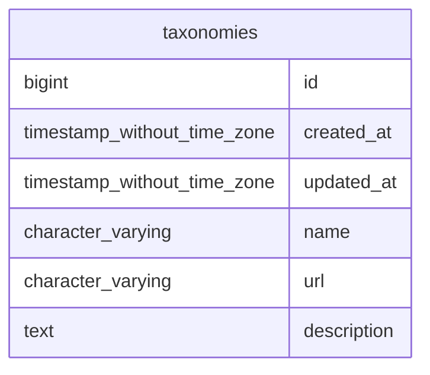
##### valuepropositions

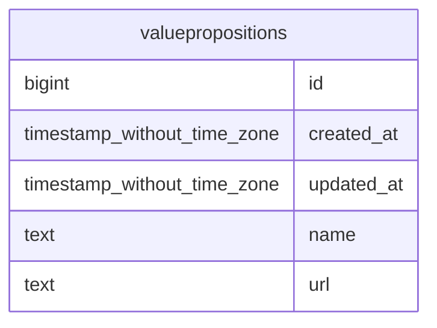
##### profile_profile_source_valueproposition
Esta tabla permite asociar los valueproposition a un profile que lo ofrece  profile_owner_id, con una persona que lo puntua el profile_evaluator_id, una puntuacion y source a esa accion de asociar el  valueproposition

Lo que establece un mecanismo para:

- evaluar la veracidad del valueproposition, es decir asegurarse que viene de la realidad
- valorar y priorizar la valueproposition
``` mermaid 
 erDiagram
profile_profile_source_valueproposition {
bigint  id 
bigint  source_id 
bigint  valueproposition_id 
bigint  profile_owner_id 
bigint  profile_evaluator_id 
bigint  taxonomy_measurementScale_id 
bigint  taxonomy_qualitativeValue_id 
double_precision  quantitativeValue 
timestamp_without_time_zone  created_at 
timestamp_without_time_zone  updated_at 
}

```
##### users

``` mermaid 
 erDiagram
users {
bigint  id 
timestamp_without_time_zone  email_verified_at 
timestamp_without_time_zone  created_at 
timestamp_without_time_zone  updated_at 
character_varying  password 
character_varying  name 
character_varying  email 
character_varying  remember_token 
}

```
##### taxonomy_taxonomy

``` mermaid 
 erDiagram
taxonomy_taxonomy {
bigint  id 
timestamp_without_time_zone  created_at 
timestamp_without_time_zone  updated_at 
bigint  taxonomy_parent_id 
bigint  taxonomy_child_id 
}

```
##### valueproposition_valueproposition

``` mermaid 
 erDiagram
valueproposition_valueproposition {
bigint  id 
bigint  valueproposition_child_id 
bigint  valueproposition_parent_id 
timestamp_without_time_zone  created_at 
timestamp_without_time_zone  updated_at 
}

```
